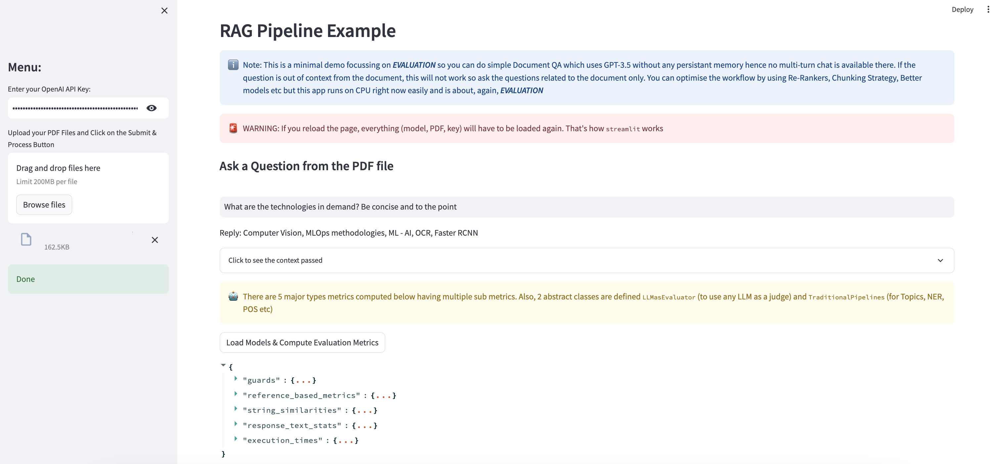

# End to End Evaluation Template for RAG Apps
A working streamlit app having end to end evaluation for more than 50+ metrics to evaluate your production. This is the template and by using FastAPI with NewRelic or Prometheus on the metrics, you can do even more. also there are LLMasJudge abstract classes which are useful to use GPt-4 type as evaluator. For more details look for `SEE_THIS.ipynb`

# How to use
Tested with: `Python 3.9`

Step: 
1. `pip install -r requirements.txt`
2. `pip install -U evaluate` (without it, some old metrics won't work)
3. `streamlit run eval_rag_app.py`
